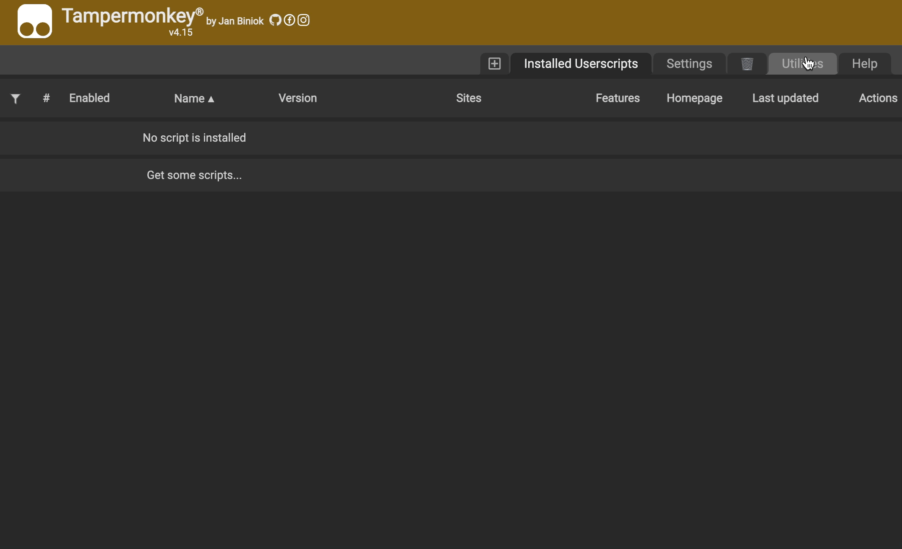

# Some Utilities for the Workshop of Cities Skylines

[中文](README_CN.md)

**More features are coming...**

> Make sure that you have already logged in first!

## One-key for subscribing and adding it into a collection

> It remembers the collection you choice last time, which means you don't have to keep reselecting every time.

## Install

Make sure you have Tampermonkey extention installed.

> Chrome: https://chrome.google.com/webstore/category/extensions

Go to Tampermonkey options page, and switch to 'Utilties' tab. Then import the script in release page and install it.

