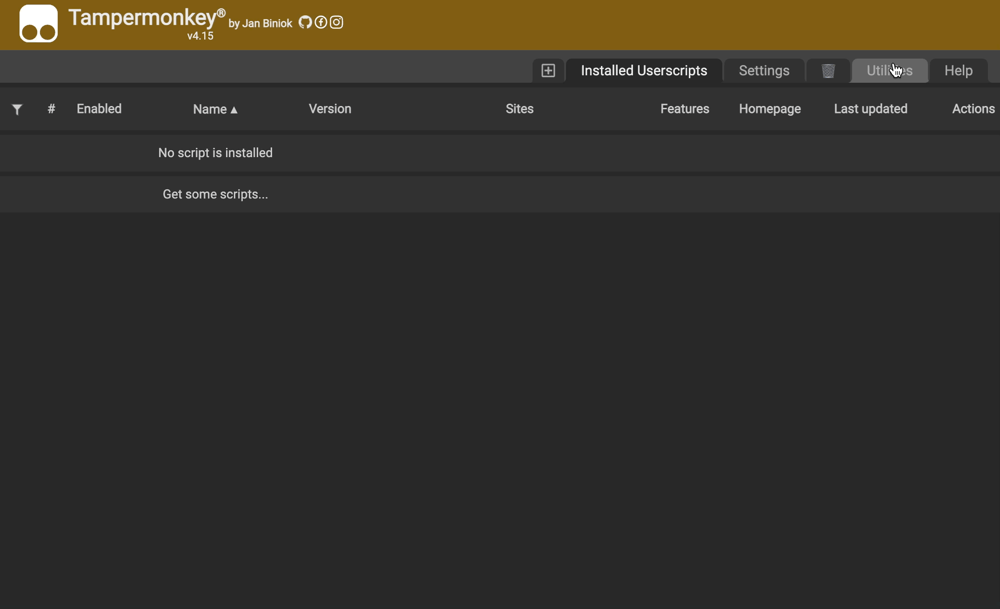

# Cities Skylines 创意工坊辅助脚本

**更多功能完善中...**

> 一定记得使用前先登录！

## 一键订阅并添加至合集

合集有助于管理成百上千的资产，或者可以区分不同存档的订阅。

> 会自动记忆你上次选择的合集，不需要每次都重新选择。

## 如何安装

首先保证安装了 Tampermonkey 浏览器插件

> Chrome: https://chrome.google.com/webstore/category/extensions

打开 Tampermonkey 设置页面，在“实用工具”中，选择导入脚本然后安装即可。

